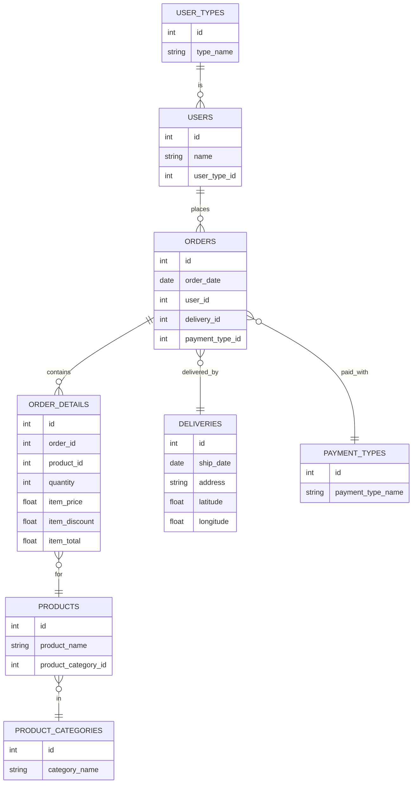
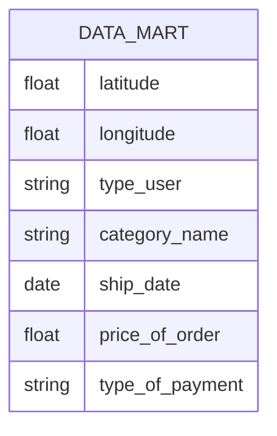

# Пишем свою BI-витрину при помощи DuckDB, Python и Dash

Примерная схема БД:



Наша витрина:



**Типовой SQL для витрины** (для примера):

```sql
SELECT
  d.latitude,
  d.longitude,
  ut.type_user,
  pc.category_name,
  o.ship_date,
  SUM(od.item_total) as price_of_order,
  pt.type_of_payment
FROM ORDERS o
JOIN USERS u ON o.user_id = u.id
JOIN USER_TYPES ut ON u.user_type_id = ut.id
JOIN ORDER_DETAILS od ON o.id = od.order_id
JOIN PRODUCTS p ON od.product_id = p.id
JOIN PRODUCT_CATEGORIES pc ON p.product_category_id = pc.id
JOIN DELIVERIES d ON o.delivery_id = d.id
JOIN PAYMENT_TYPES pt ON o.payment_type_id = pt.id
GROUP BY
  d.latitude, d.longitude, ut.type_user, pc.category_name, o.ship_date, pt.type_of_payment
```

## Создание виртуального окружения

```bash
python3.12 -m venv venv && \
source venv/bin/activate && \
pip install --upgrade pip && \
pip install poetry && \
poetry lock && \
poetry install
```

### Добавление новых зависимостей в окружение

```bash
poetry lock && \
poetry install
```

## Запуск приложения

Активируем виртуальное окружение:

```bash
source venv/bin/activate
```

Запускаем приложение:

```bash
python app.py
```