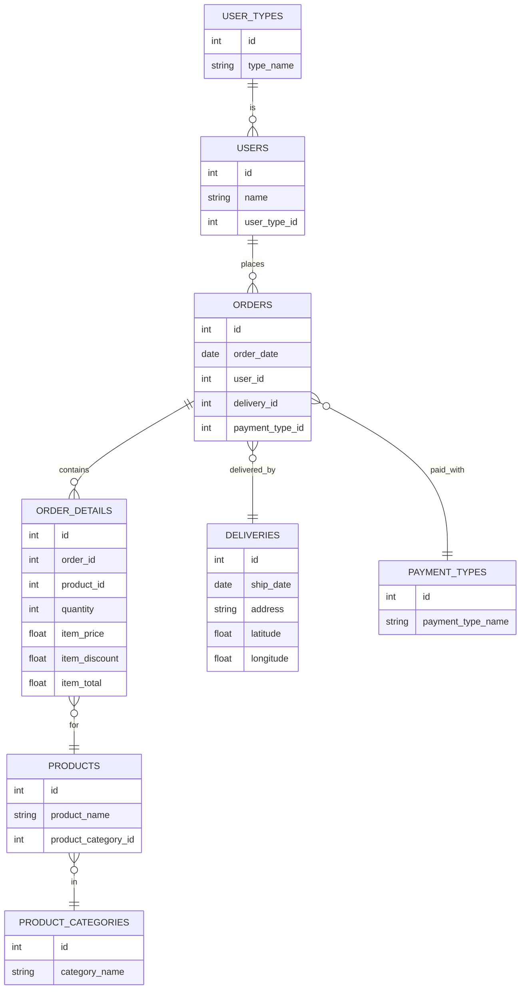
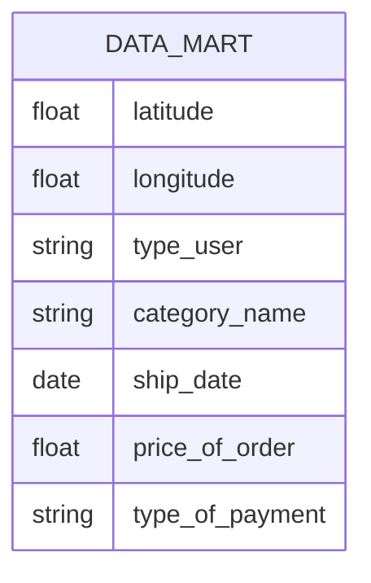

# Пишем свою BI-витрину при помощи DuckDB, Python и Dash

В этом [видео](https://youtu.be/FzWZwRyFuI4) я покажу лучший проект для дата-инженера по работе с гео-данными и созданием витрин данных. Мы рассмотрим
множество инструментов: Python, Docker, Git, S3 Minio, PostgreSQL, DuckDB, Plotly, Dash Plotly. Покажу и расскажу, что
такое модель данных, что такое витрина, зачем нужна витрина и зачем тут дата-инженер

📌 Что вы узнаете:
- Как устроена типовая задача в анилитке
- Как создать рабочую инфраструктуру под pet project
- Как управлять зависимостями и конфигурацией
- Как создать витрины данных и визуализации
- Идеи для других проектов с гео-данными

💻 Менторство/консультации по IT – https://korsak0v.notion.site/Data-Engineer-185c62fdf79345eb9da9928356884ea0

📂 Полный проект на GitHub: https://github.com/k0rsakov/pet_project_customizable_dashboard

👨‍💻 Подходит для начального уровня, junior и middle дата-инженеров, ищущих реальный опыт и сильное портфолио.

🔔 Подписывайтесь и ставьте лайк, если хотите больше практических видео!

Ссылки:
- Менторство/консультации по IT – https://korsak0v.notion.site/Data-Engineer-185c62fdf79345eb9da9928356884ea0
- TG канал – https://t.me/DataLikeQWERTY
- Instagram – https://www.instagram.com/i__korsakov/
- Habr – https://habr.com/ru/users/k0rsakov/publications/articles/
- Git-репозиторий из видео – https://github.com/k0rsakov/pet_project_customizable_dashboard
- Всё что нужно знать про DuckDB – https://habr.com/ru/articles/829502/
- Инфраструктура для Data-Engineer BI-tools – https://habr.com/ru/articles/856922/

Тайминги:
- 00:00 – Начало
- 00:55 – Разбор модели данных интернет-магазина
- 03:01 – Что такое витрина данных
- 05:02 – Инструменты для создания витрины
- 06:11 – Что такое Dash Plotly
- 08:01 – Самостоятельная генерация данных
- 12:23 – Разбор BI-приложения на Flask
- 15:13 – Запуск BI-приложения на Flask
- 15:58 – Работа с BI-приложением на Flask, исследование данных
- 19:21 – Объяснение важности витрины данных
- 21:34 – Больше информации про BI-инструменты
- 22:37 – Примеры других пет-проектов с гео-данными


Примерная схема БД:



Наша витрина:



**Типовой SQL для витрины** (для примера):

```sql
SELECT
  d.latitude,
  d.longitude,
  ut.type_user,
  pc.category_name,
  o.ship_date,
  SUM(od.item_total) as price_of_order,
  pt.type_of_payment
FROM ORDERS o
JOIN USERS u ON o.user_id = u.id
JOIN USER_TYPES ut ON u.user_type_id = ut.id
JOIN ORDER_DETAILS od ON o.id = od.order_id
JOIN PRODUCTS p ON od.product_id = p.id
JOIN PRODUCT_CATEGORIES pc ON p.product_category_id = pc.id
JOIN DELIVERIES d ON o.delivery_id = d.id
JOIN PAYMENT_TYPES pt ON o.payment_type_id = pt.id
GROUP BY
  d.latitude, d.longitude, ut.type_user, pc.category_name, o.ship_date, pt.type_of_payment
```

## Создание виртуального окружения

```bash
python3.12 -m venv venv && \
source venv/bin/activate && \
pip install --upgrade pip && \
pip install poetry && \
poetry lock && \
poetry install
```

### Добавление новых зависимостей в окружение

```bash
poetry lock && \
poetry install
```

## Запуск приложения

Активируем виртуальное окружение:

```bash
source venv/bin/activate
```

Запускаем приложение:

```bash
python app.py
```

## Структура проекта

### Полигоны

Свои полигоны, сгенерированные с помощью [kepler.gl](https://kepler.gl/):

```bash
.
├── polygon_data_left.json
├── polygon_data_right.json
└── polygon_data_up.json
```

### Генерация данных

Запустите скрипт `generate_duckdb_sample_database.py` для генерации данных в указанных полигонах:

```bash
.
└── generate_duckdb_sample_database.py
```

Изменить количество записей, полигоны и прочее можно в `generate_duckdb_sample_database.py`
